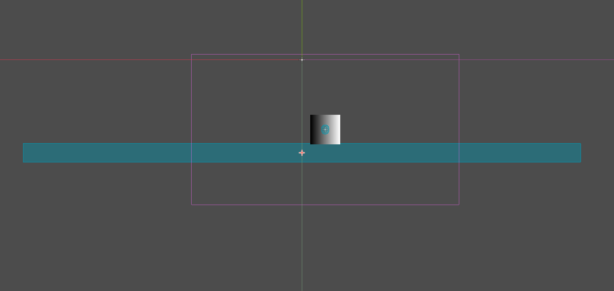
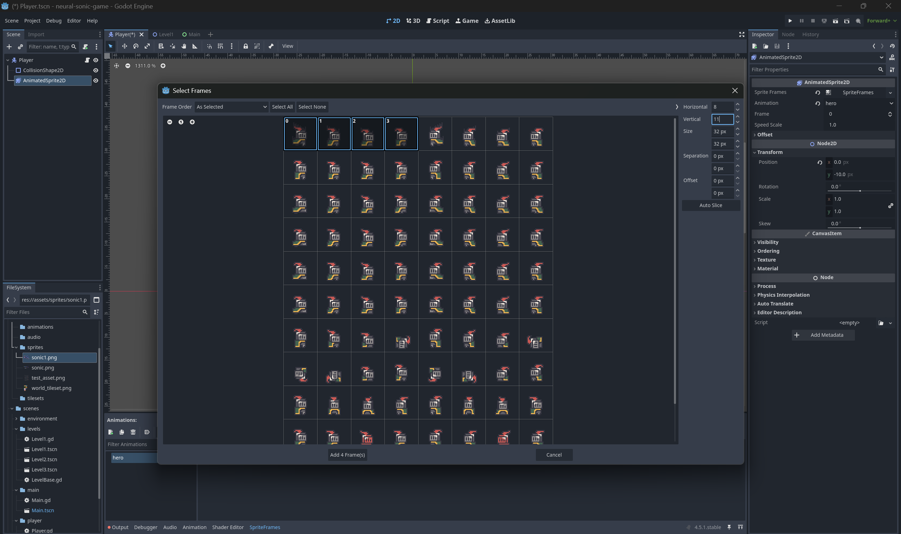
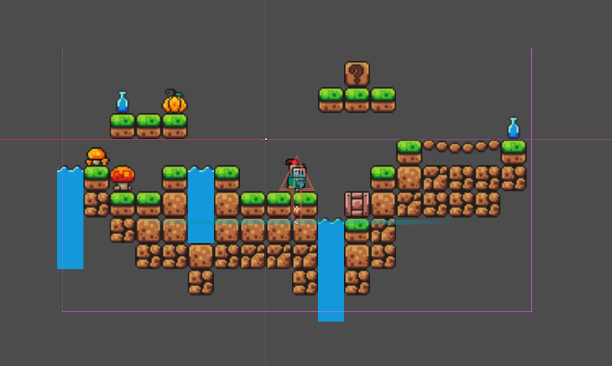
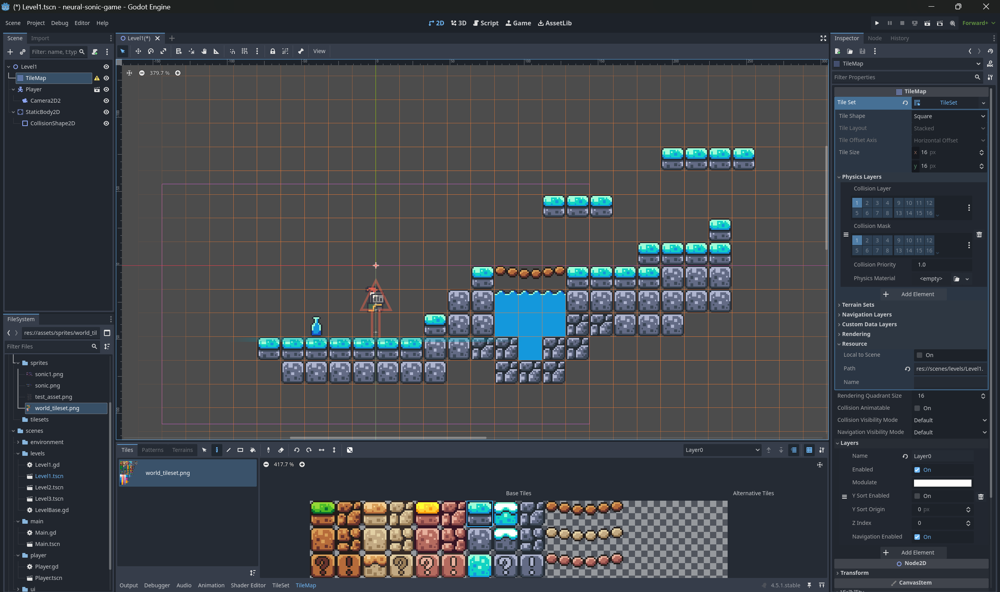

# NeuralSonic - 13.04

## What I did
  
  So I added a simple player, first as a shape, I used the default script for movement and I made a simple level, a ground. Then I added free pixel art assets from these sources:
  - https://kevins-moms-house.itch.io/camelot
  - https://brackeysgames.itch.io/brackeys-platformer-bundle

(There I had a problem with the graphics)

## Problems I had in this part:

- physics, physics, physics...
- problems with the Camera movements
- problems with the Home Screen
- animations

