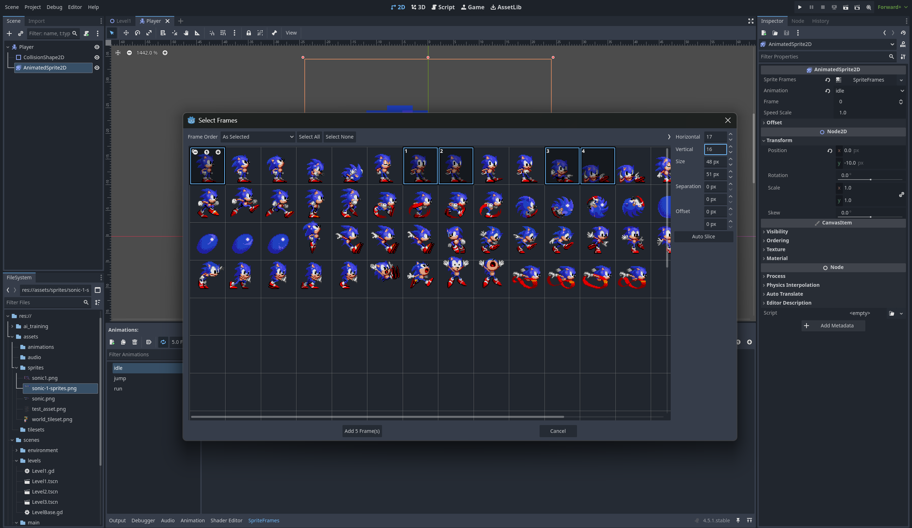
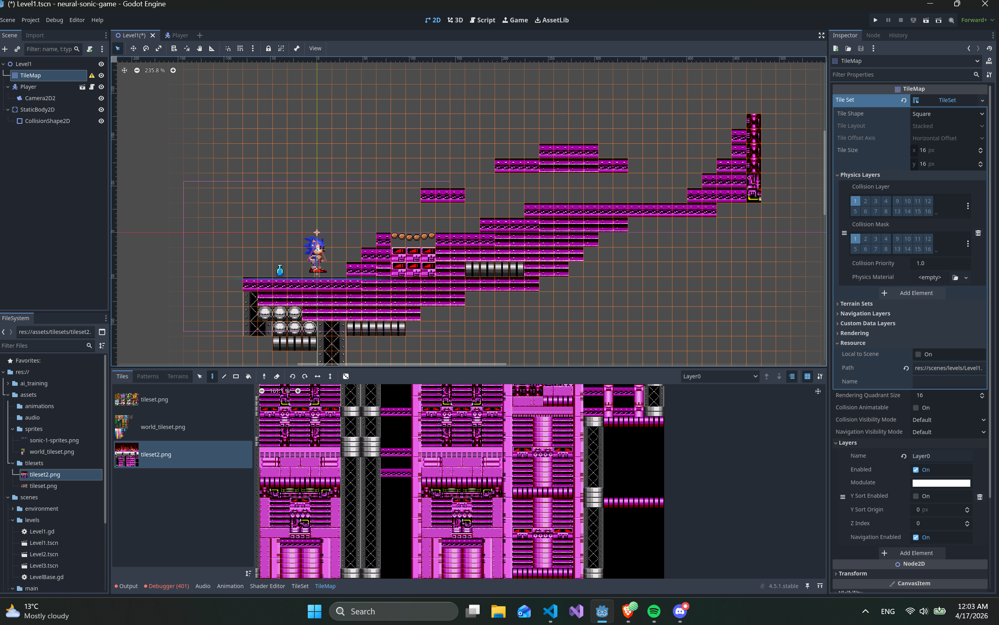
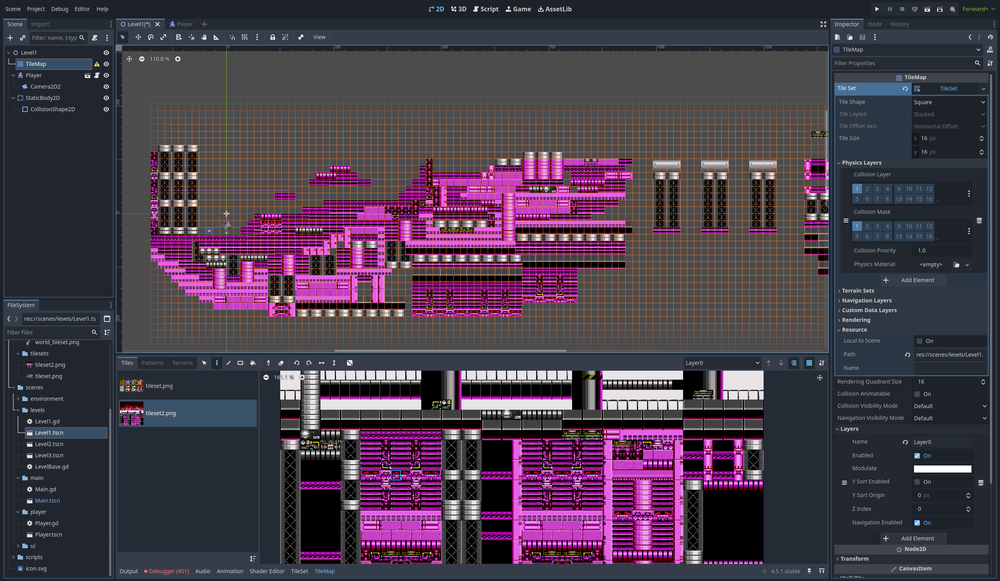
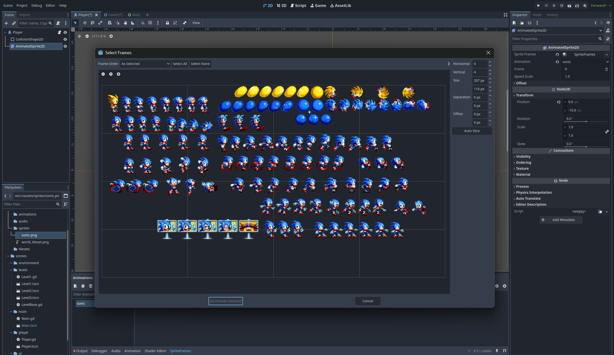
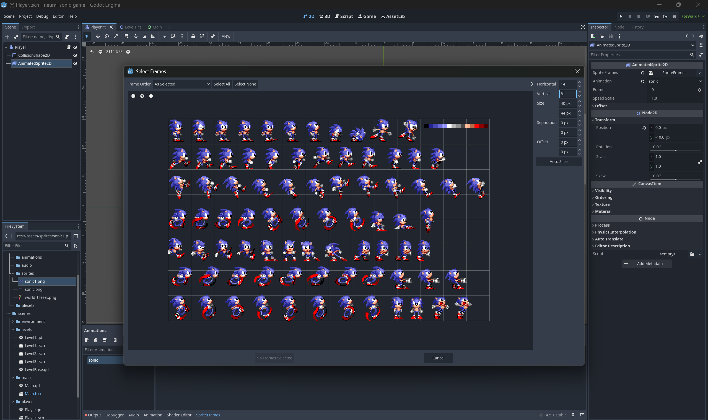
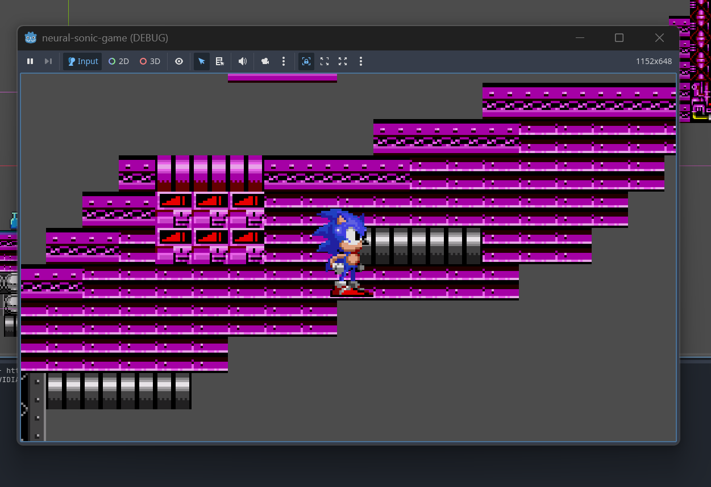
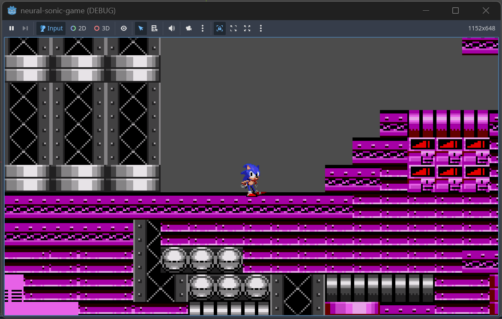

# NeuralSonic - 16.04
  

## What I did

I added a Sonic sprite and found assets for the tilemaps, the player. I made some not very good (but original) design of level 1. I decided not to copy the game, but to create levels, which are original and not existing yet. Assets used in this part:
- https://tcrf.net/Proto:Sonic_the_Hedgehog_2_(Genesis)/Nick_Arcade_Prototype/Chemical_Plant
- https://www.spriters-resource.com/sega_genesis/sonicth1/
- https://github.com/Andreas-Atomphi/Hedgegodot2D-Framework/tree/main (the Sonic sprite)

Adding Sonic sprite

Here I started making a simple level

## Problems I had in this part:

### Sprite problems:

So the assets I used at first weren't the best and I had problems with making the animations and choosing different frames
Here are some screenshots:

### Physics problems:

The player wasn't on the map, it was **in** the map:

Fixed

## To-do:
- implement rings, points, lives, count
- implement some obstales (spikes, monsters, etc.)

