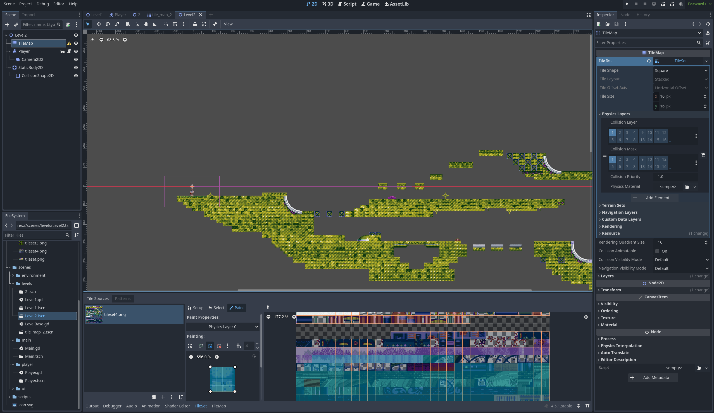
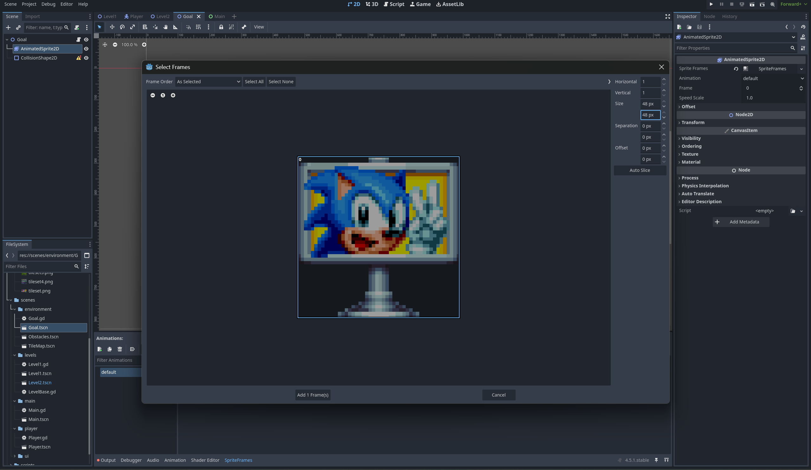
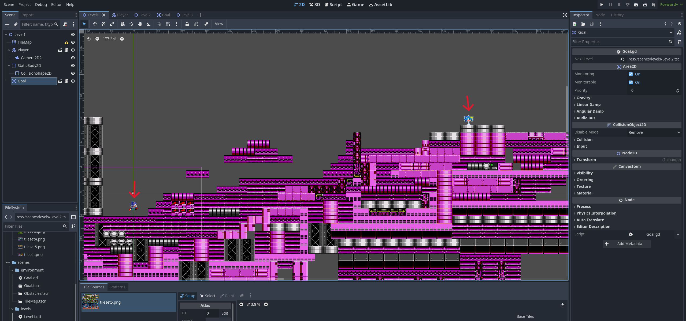
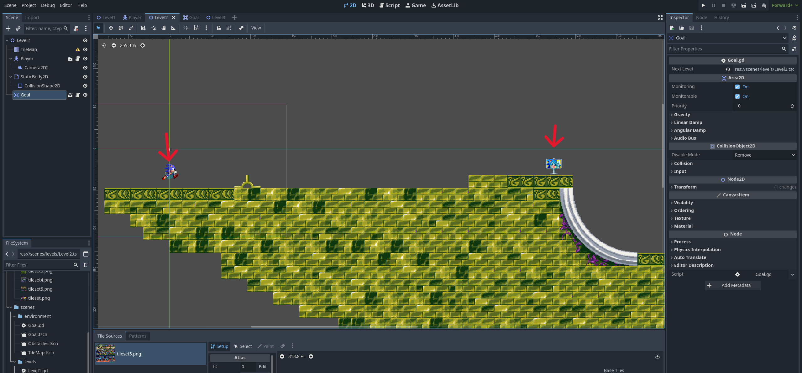
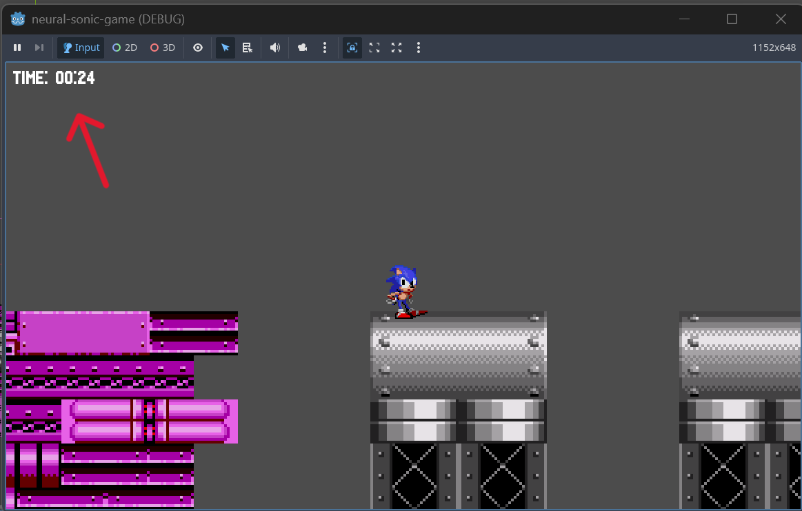
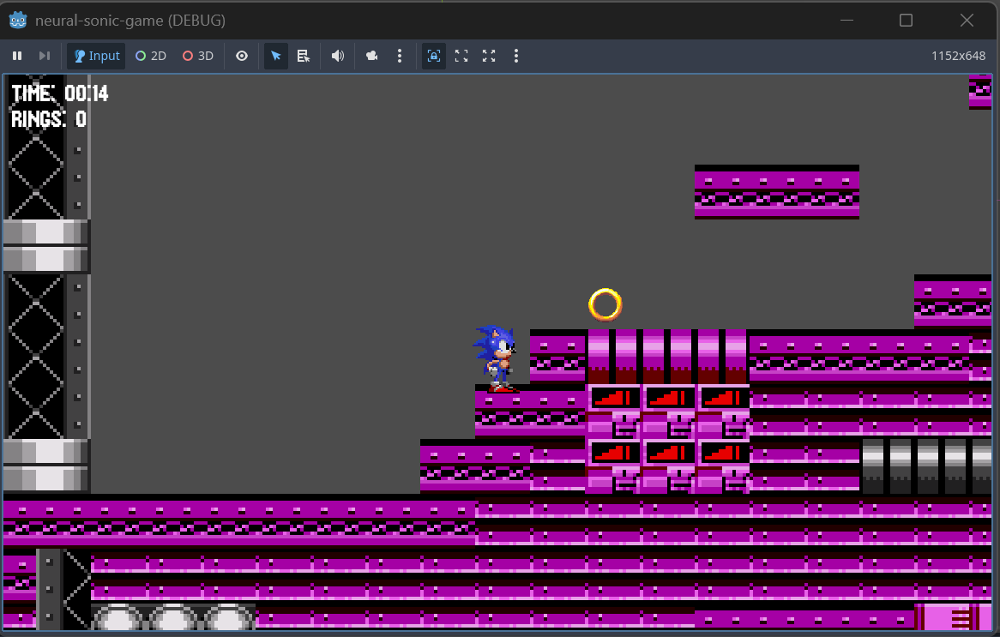
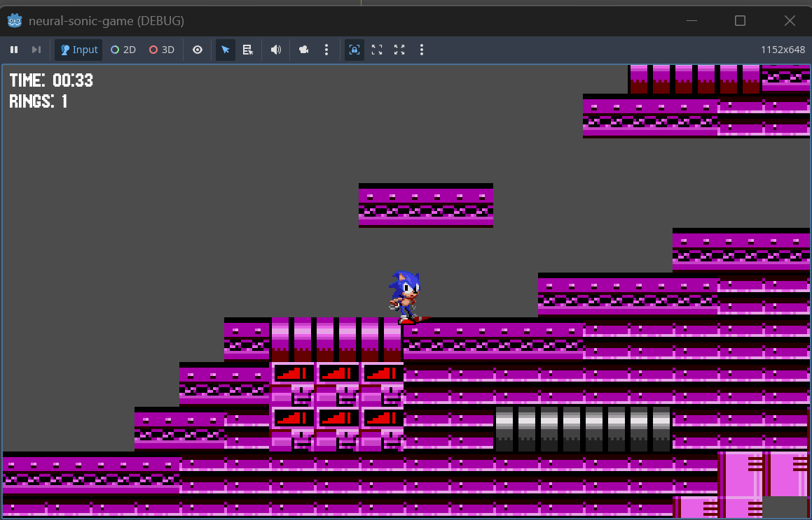

# NeuralSonic - 18.04

## What I did
I made Level1 and Level2, using tilesets. Also I added a goal (the transtitions between the levels), timer and a simple logic for the rings and scores.
Assets:
- https://www.spriters-resource.com/pc_computer/sonicmania/asset/109494/ (for Level2)
- https://www.dafont.com/mania.font (font)
- https://info.sonicretro.org/Signpost (goal plate)
- https://www.deviantart.com/xxyumbielikespixel/art/Sonic-ring-png-961929288 (ring animation)

Making Level2

Adding goal plate

Putting a goal in Level1

Putting a goal in Level2

Adding a timer as HUD (seen in all levels, resetting each time the player passes a level)
Adding the Sonic Mania font

Rings count before collecting the ring

Rings count after collecting the ring

## To-do:
- add more rings, like a tilemap with rings
- add transitions between levels
- make level3
- add lives count and obstacles (spikes)
