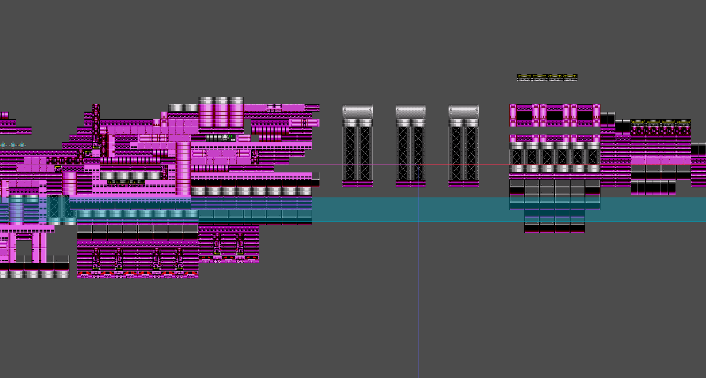
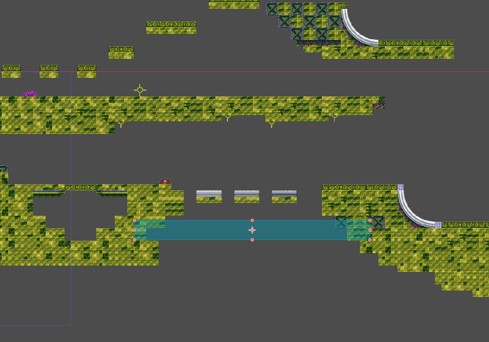
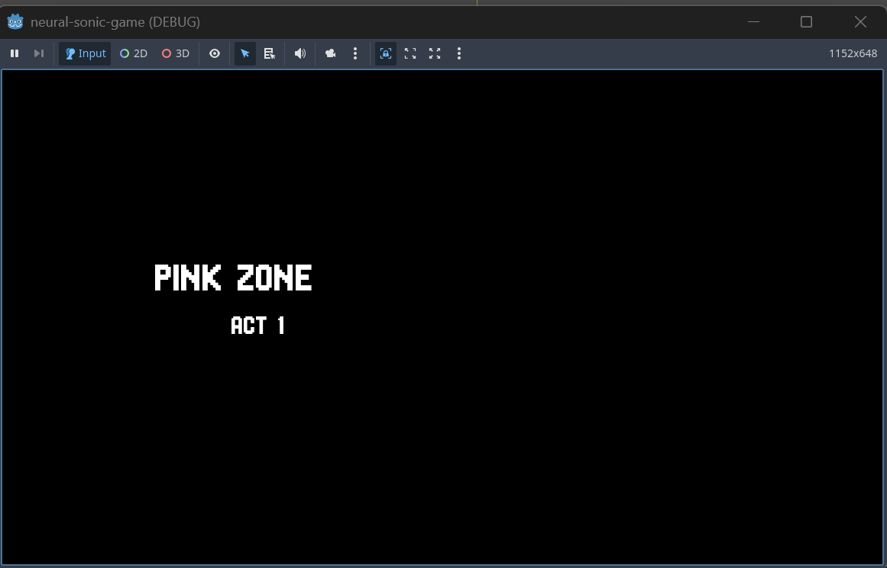
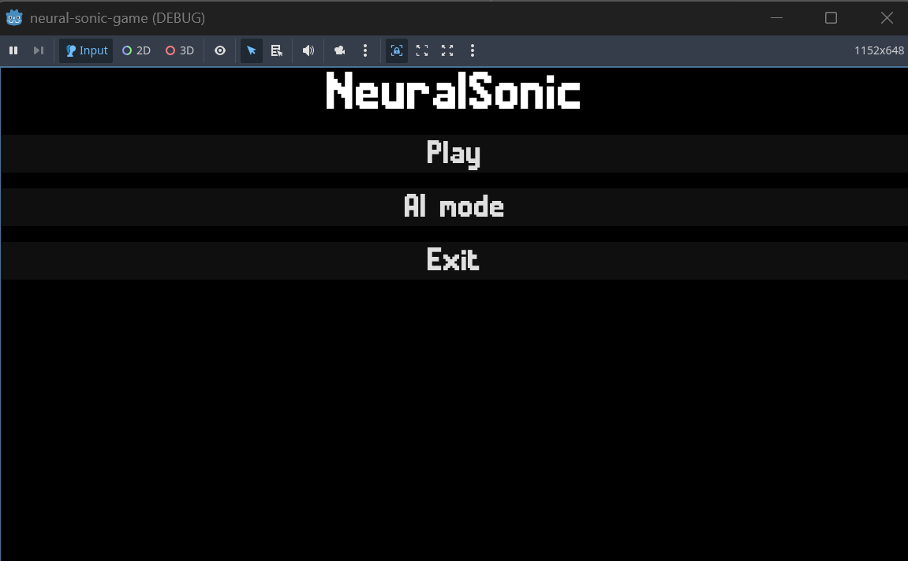
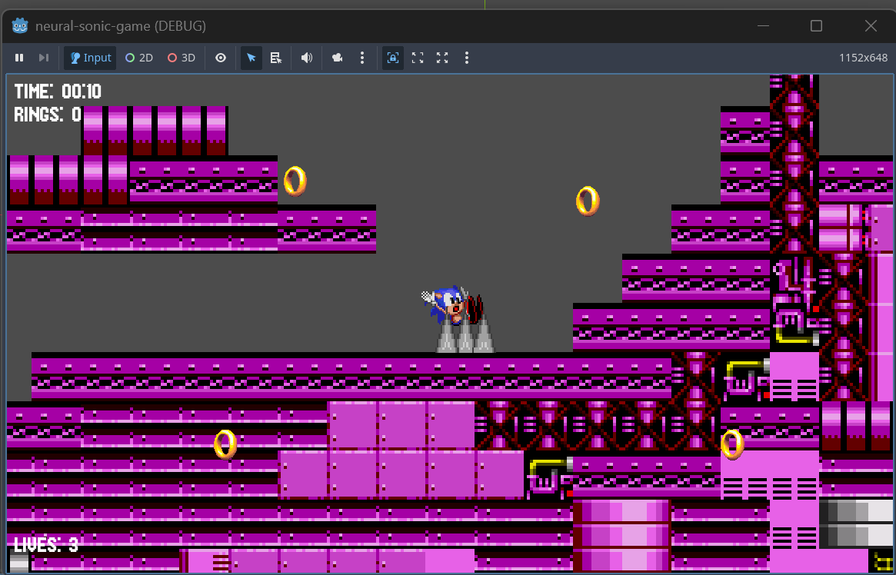
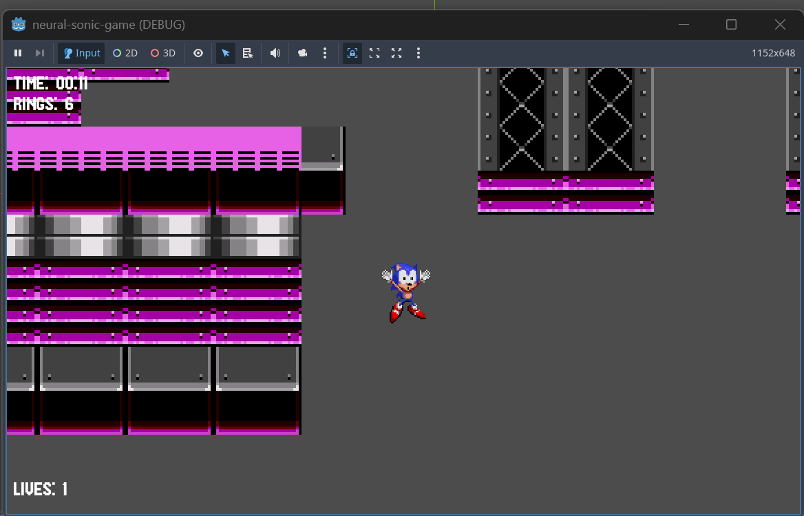
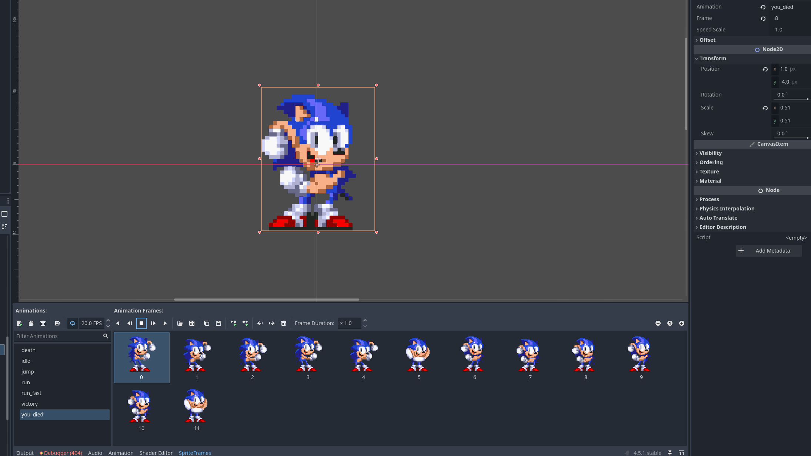
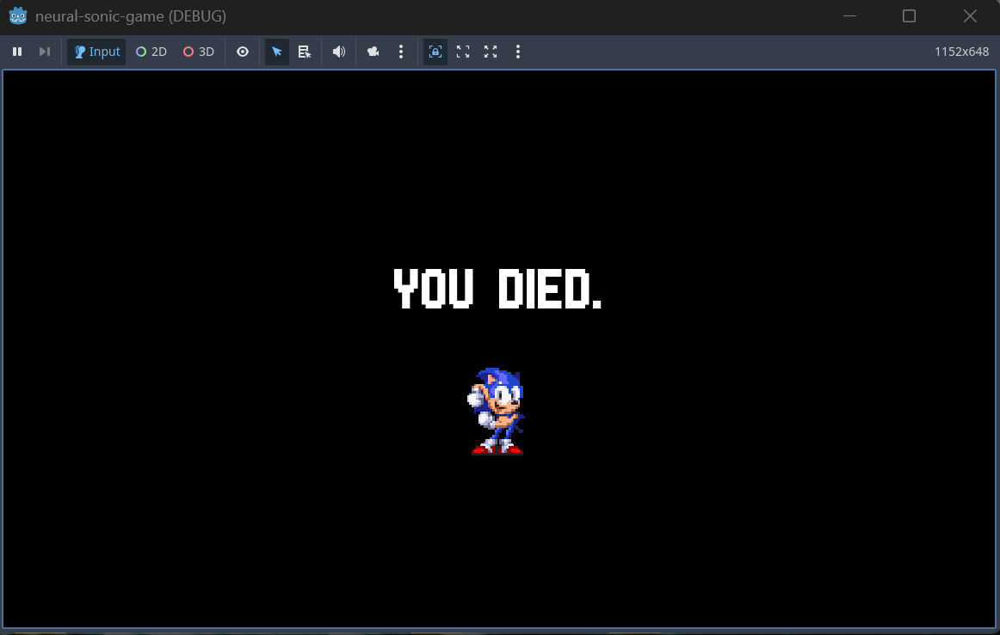
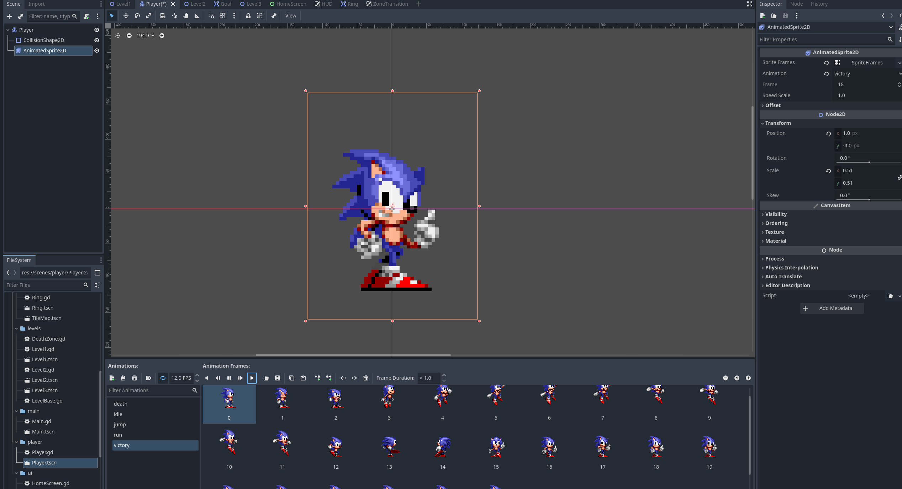
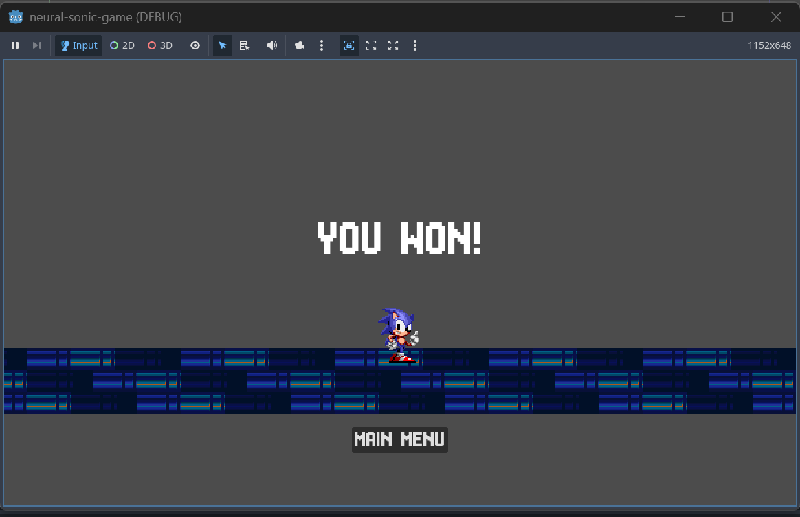

# NeuralSonic - 19.04

## What I did
I added:
- lives 
- a deathzone in each level and obstacles (spikes)
- transitions between levels 
- Death screen
- Final screen
- changed the design for the Home Screen 
- more animations

Assets used in this part:
- https://www.deviantart.com/retroreimagined/art/Mania-Sonic-s-victory-pose-but-it-s-the-original-868760148 (victory animation)
- https://tenor.com/view/sonic-the-hedgehog-dancing-gif-17810565669928980934 (you died animation)
- https://www.nicepng.com/maxp/u2w7r5e6a9i1y3u2/ (spikes)

Deathzone on level 1

Deathzone on level 2

Transition on level 1 (it has animation)

Simple menu

Spikes (if the player touches them he looses his rings and starts from 0. if he touches the spikes with 0 rings he looses one life)

Death (the player touches the deathzone)

You died animation

Deathscreen (when the player looses his 3 lifes. game restarts from the level)

You won animation

Finalscreen (if the player passes all of the levels)

## To-do:
- fix home screen, maybe add some animation before the menu
- add more obstacles and rings
- add menu where you can pause the game and control things
- **make AI mode, train AI**

