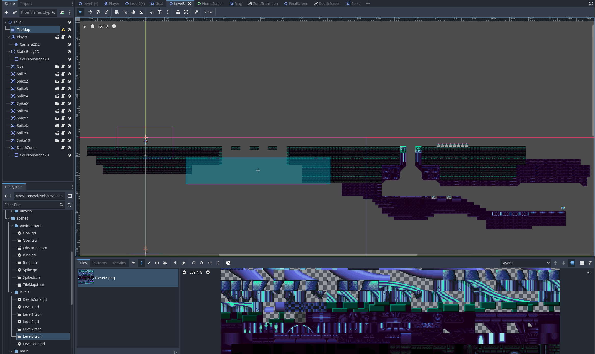
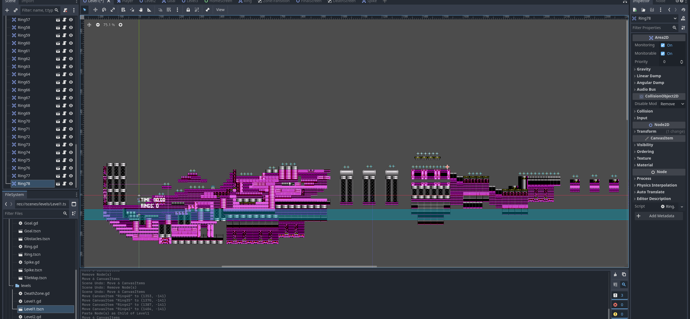
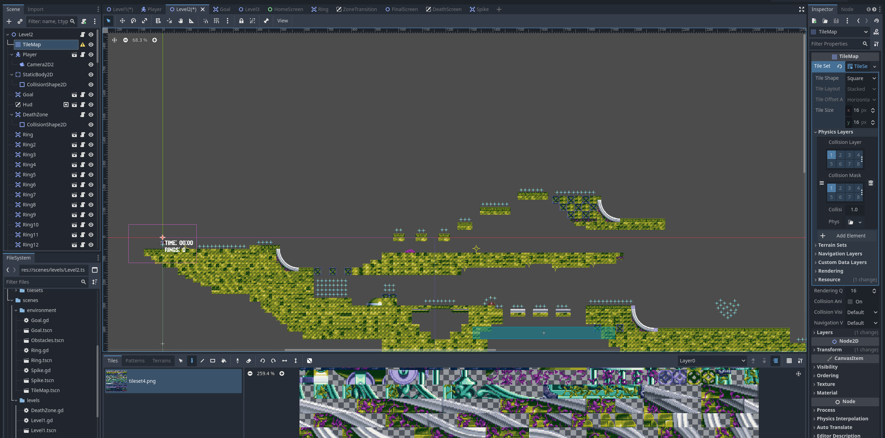
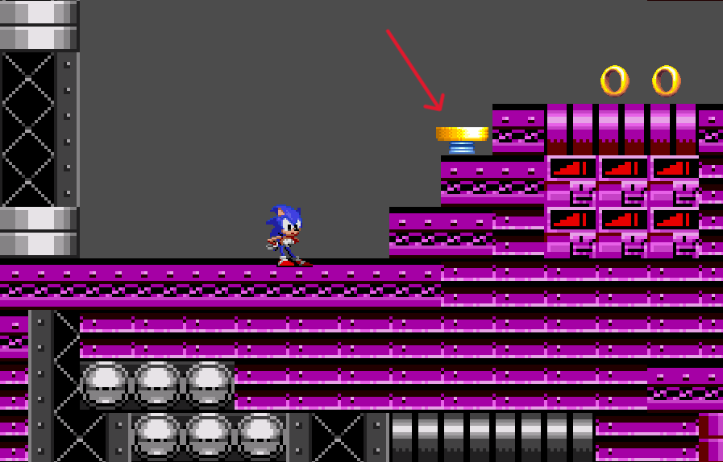
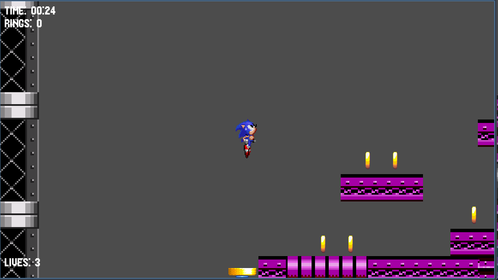

# NeuralSonic - 20.04

## What I did
I started making level3, put some rings and obstacles in level1 and level2. Deathzones. Added springs (the jumping thing).

Assets used:
- ...
- https://www.spriters-resource.com/custom_edited/sonicthehedgehogcustoms/asset/93747/ (spring sprite)

Level3 simple ver.

Here's the spring

When the player goes on the spring, it jumps

## To-do:
- fix home screen, animation before the menu
- esc menu
- obstacles
- AI
