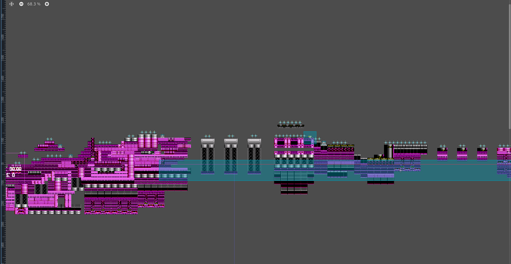
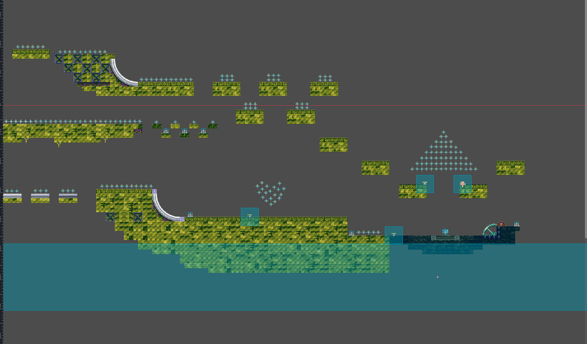
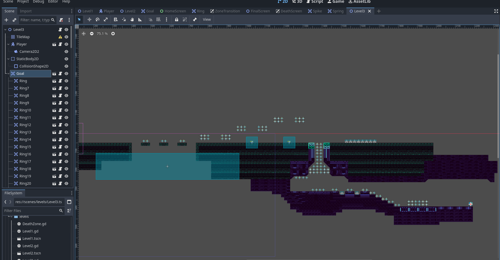
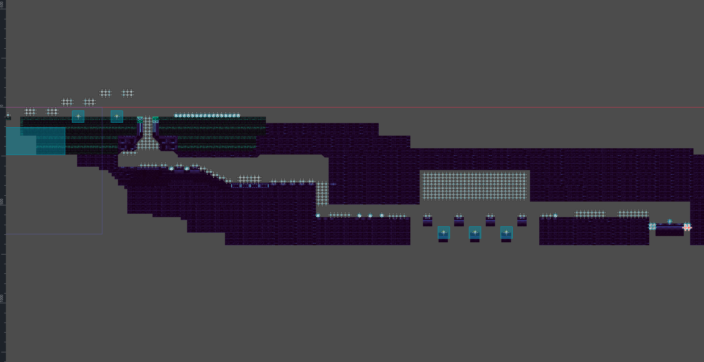
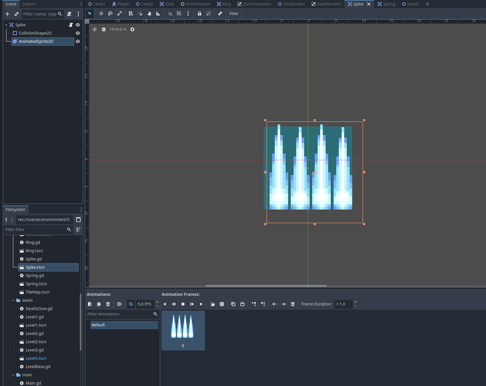

# NeuralSonic - 21.04

## What I did
- designs of all levels/maps
- added objects, osbtacles to the levels
- fixed some animations (like the hit animation, when the player hits a spike, an obstacle)
- new spike design
- added the rule - when the player collects 100 rings, it gets a new life 
- fixed bugs like HUD not displaying in level3 and deathzones

No new assets used in this part.

Level1 final

Level2 final

Level3 first

Level3 final 

New spike design

## To-do:
- better home menu
- add backgrounds to all levels
- **esc menu**
- **AI!!!**

