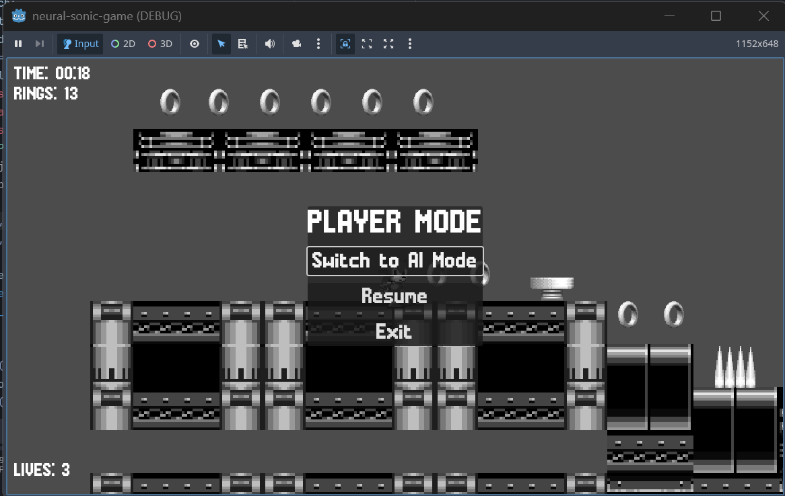

# NeuralSonic - 24.04

## What I did
First of all I connected the AI mode button to the AI mode, there I wanted to add all the animations and things in this mode, because that way the game would have looked more professional. The point in the AI mode was to load an existing model, the latest or to train it in the moment. I updated the script to save an AI model in a folder after some time, after some steps and training. I added all of the animations and transitions in AI mode too. 

### Bugs here:
- reloading
- loosing the connection between Python script and Godot Game engine
- AI training crashing after some minutes

I realized that when the AI dies - the level reloads, so it has to play the animation/transition I wanted. I fixed it - to connect to the script again automatically. But I realized it doesn't do anything, because if the AI plays and it dies it reloads it all and starts from zero - it doesn't train anything. 
The crash in the training was because of a memory leak - for example the rings the AI is loosing when it hits spikes - I forgot to delete them and they were just there, more and more, and this was leading to a leak and slowing the program, then crashing it.

### Solutions:
I fixed the reload problem by simply just spawning the AI player to the start once it dies. This way it connected to the script once - in the start and then every time it dies the level isn't reloaded and connection isn't lost. 
The memory leak problem - I added this part in the code where when the player hits a spike and it's rings are lost they are automatically deleted if they go very low (because I have a scatter rings animation and they just go down the level ground). This way the program didn't crash.

In this part I also made a Pause Menu. When the user hits "esc" they have three options - to switch to a different mode (if they're in Player mode, they can switch to AI and so on); to resume the game and to exit it. I also tried making it look like in the original Sonic games, where when you hit esc you have this menu and the level freezes and goes black and white. 

Screenshot from the Pause menu:

